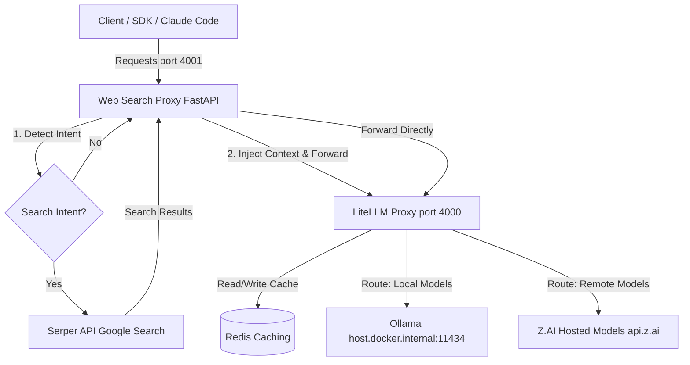

# System Architecture

The LiteLLM Web Search Proxy stack is designed to intercept LLM chat completion requests, dynamically inject real-time web search results (RAG) when intent is detected, and serve responses in a standard API format.

## Overview

The stack consists of three containerized services running on a shared Docker bridge network, communicating with local/remote LLM backends and external search APIs.

---

## Port Mappings & Component Roles

| Port | Service | Container Name | Description |
|---|---|---|---|
| **4001** | **Web Search Proxy** | `websearch-proxy` | Custom FastAPI service running `websearch_proxy.py`. Handles intent detection, web search execution, system prompt modification, and Anthropic SSE stream compatibility. |
| **4000** | **LiteLLM Proxy** | `litellm-proxy` | Core LiteLLM service running model routing, request mapping, parameter normalization, and Redis-based response caching. |
| **6379** | **Redis** | `litellm-redis` | Redis container used exclusively by LiteLLM for response and metadata caching. Not exposed to the host system. |
| **11434** | **Ollama** (Host) | - | Runs on the developer's local host machine. Reached from within the Docker network via `host.docker.internal:11434`. |

---

## Detailed Request Flow

### Scenario A: Request WITH Search Intent
Example Query: *"Search for the latest Python release notes"*

1. **Client Request**: The client sends an Anthropic-style messages payload to `http://localhost:4001/v1/messages`.
2. **Intent Detection**: The Web Search Proxy analyzes the last `user` message:
   - Detects explicit keywords (`search`, `look up`) or recency signals (`latest`, `recent`).
   - Filters out system instructions, code indicators, and extremely long text blocks.
3. **Web Search**: The proxy executes a search query via the external **Serper API** (Google search results).
4. **Context Injection**:
   - The Serper results (answer box and organic snippets) are formatted into a markdown system instruction block.
   - This block is appended/injected into the `system` parameter of the API request.
5. **LLM Execution**: The proxy forwards the enriched request as a **non-streaming** call to the LiteLLM Proxy (port 4000).
6. **Streaming Emulation**:
   - Since search-augmented queries are run as non-streaming to prevent partial/malformed contexts, the Web Search Proxy simulates an Anthropic SSE stream from the complete response block.
   - It filters out model `thinking` tags and cleans the output text before delivering it to the client.

### Scenario B: Request WITHOUT Search Intent
Example Query: *"Write a quicksort implementation in Python"*

1. **Client Request**: The client sends a request to `http://localhost:4001/v1/messages`.
2. **Intent Detection**: No search keywords or recency signals are detected, or code indicators (e.g. `"write a"`) trigger a bypass.
3. **Bypass & Forward**:
   - The Web Search Proxy strips any Anthropic-native web search tools and parameters.
   - It forwards the request (maintaining streaming vs. non-streaming settings) directly to `http://localhost:4000/v1/messages`.
4. **LiteLLM Processing**:
   - LiteLLM checks its Redis cache. If cached, it returns the cached response.
   - Otherwise, it forwards the request to the configured backend (Ollama, Z.AI, etc.).
5. **Streaming Response**: The response stream is piped straight back to the client.
